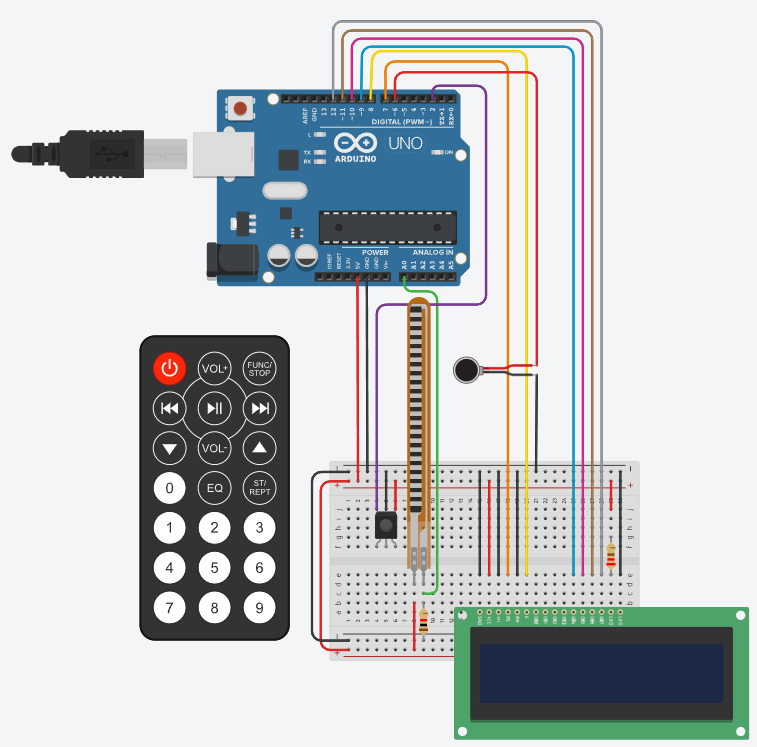

# Dispositivo de Treinamento de Sensação Tátil com Feedback em Tempo Real

**Descrição:** Neste projeto, vamos aprender a construir o dispositivo acima utilizando o Arduino Mega. Tal projeto envisa auxiliar no processo de reabilitação motora e sensorial de pacientes. Além disso, o mesmo é ideal para quem deseja aprender a combinar sensores e atuadores em aplicações práticas. Ao final do tutorial, você terá adquirido as seguintes habilidades:
- Configurar sensores analógicos (por exemplo, flex sensor) e atuadores (como motores vibratórios) para monitorar e responder a estímulos;
- Integrar e programar um idsplay LCD para forncecer feedback visual ao usuário;
- Implementar controles remotos infravermelhos para criar interfaces de interação acessíveis.

Este tutorial é voltado para **estudantes de eletrônica**, **profissionais de reabilitação** e **entusiastas de tecnologia**, permitindo aplicar conhecimentos de eletrônica e programação em um contexto prático e significativo.

---

## Índice

1. [Introdução](#introdução)
2. [Requisitos](#requisitos)
3. [Configuração do Ambiente](#configuração-do-ambiente)
4. [Montagem do Circuito](#montagem-do-circuito)
5. [Programação](#programação)
6. [Teste e Validação](#teste-e-validação)
7. [Expansões e Melhorias](#expansões-e-melhorias)
8. [Referências](#referências)

---

## Introdução

O dispositivo em questão é uma solução prática e acessível para apoiar pacientes na reabilitação de habilidades motoras finas e sensibilidade tátil, especialmente em casos de lesões, cirurgias ou doenças neurológicas. Por meio de um sensor flexível, o mecanismo mede o movimento de flexão dos dedos, enquanto um motor vibratório oferece feedback tátil para reforçar o progresso do usuário. Um display LCD exibe mensagens motivacionais e informações em tempo real, promovendo engajamento e autonomia durante o processo de reabilitação. Este projeto se integra ao mundo IoT ao trazer a possibilidade de conectividade com maior eficiência ao processo terapêutico e médico, permitindo que ambos possam acompanhar o avanço da reabilitação em tempo real, reduzindo a necessidade de acompanhamento presencial e proporcionando uma experiência mais personalizada e contínua.

---

## Requisitos

### Hardware

- **Placa**: Arduino Mega ou Mega 2560.
- **Sensores**: Sensor flexível (Flex Sensor) e Receptor IR (Infravermelho).
- **Atuadores**: Motor vibratório e Display LCD 16x2.
- **Outros componentes**: Resistores (1kΩ e 220Ω), uma protoboard e um controle remoto infravermelho.

### Software

- **Linguagens**: C
- **IDE**: Arduino IDE, Tinkercad(opcional)
- **Bibliotecas**: `LiquidCrystal`(para controle do display LCD) e `IRremote`(para controle remoto IR -infravermelho).

---

## Configuração do Ambiente

### Passo 1: Instalação do Software

- **Arduino IDE**: [Baixe](https://www.arduino.cc/en/software) e instale a IDE do Arduino para programar o Arduino Uno.
- **Bibliotecas**: A biblioteca `LiquidCrystal` e `IRremote` podem ser instaladas como o exemplo mostra abaixo.

1. Procure pelo seguinte ícone, após a instalação da IDE:

2. Na área de texto escreva `LiquidCrystal` e escolha a opção "by Arduino".
3. Analogamente, escreva `IRremote` e escolha a opção "by shirriff, z3t0, ArminJo".

### Passo 2: Configuração das Placas

- Conecte o Arduino Mega ao computador usando um cabo USB.
- Selecione sua _board_ na opção a seguir:

1. Clique em _Select other board and port_;
2. Selecione a _board_ **Arduino Mega or Mega 2560**;
3. Por fim, selecione a _Port_ de sua preferência.

---

## Montagem do Circuito

- Visualização do circuito completo. Para acessá-lo, [clique aqui](https://www.tinkercad.com/things/94V5gX0DVnz-tactile-sensation-trainer-disp-de-treinamento-tatil?sharecode=qD5HM9E1MGavEF_37VUUt3lIj1bFfyhjSw5nbfDZV0k)

>[!NOTE]
>Se é sua primeira vez usando um LCD, é bem capaz que você tenha que soldar pinos nele para conectá-lo a _protoboard_ e, enfim, seguir para as Conexões do Circuito.

### Conexões do Circuito:
1. Sensor Flexível:
   - Um terminal no pino A0, conecte-o como o cabo verde demonstra na figura;
   - Conecte o outro terminal ao 5V(+) da _protoboard_;
   - Abaixo da conexão do terminal no pino A0, insira um resistor de 1kΩ no GND(-) da _protoboard_.
2. Motor Vibratório:
   - Pino positivo ao pino digital 6 e negativo ao GND(-) da _protoboard_;
3. Receptor IR:
   - Pino de dados(OUT) ao pino 2, Power ao 5V(+) da _protoboard_, GND ao GND(-) da _protoboard_.
5. LCD 16x2 — Começando da Esquerda para a Direita:
   - GND do LCD para GND(-) da _protoboard_;
   - VCC do LCD para 5V(+) da _protoboard_;
   - VO para o GND(-) da _protoboard_, isso fará que o contraste do LCD esteja no máximo;
   - RS do LCD para o pino 7 do Arduino;
   - RW do LCD para o GND(-) da _protoboard_;
   - E (Enable/Ligado) do LCD para o pino 8 do Arduino;
   - DB0 até DB3 não serão usados, por isso pule eles;
   - DB4, DB5, DB6 e DB7 do LCD para os pinos 9, 10, 11 e 12 do Arduino, respectivamente;
   - LED (Backlight/Luz de Fundo) do LCD para um resistor de 220Ω e conecte esse resistor ao 5V(+) da _protoboard_;
   - O último LED, você pode conectá-lo ao GND(-) da _protoboard_.
>[!WARNING]
>Certifique-se de que todas as conexões estão firmes e corretas antes de prosseguir com a programação. Em caso de dúvida, refaça esta etapa consultando diretamente a simulação, link acima.

---

## Programação

### Passo 1: Configuração dos Sensores e Atuadores

#### Bibliotecas
```cpp
#include <LiquidCrystal.h> //Controla o LCD 16x2, simplificando comandos para printar texto ou mover o cursor
#include <IRremote.h> // Decodifica os sinais de um controle remoto infravermelho, permitindo que o Arduino entenda o pressionamento de botoes
```

#### Atribuição de Pinos
```cpp
const int flexPin = A0;    //Sensor flexivel conectado ao pino analogo A0         
const int vibrationMotorPin = 6;    //Motor vibratorio conectado ao pino digital 6 (Compativel com PWM)
const int receiverPin = 2; //Receptor IR conectado ao pino digital 2
```
  - `flexPin`: Lê a resistência do sensor flexível. A resistência muda a medida que o dedo se mexe;
  - `vibrationMotorPin`: Ativa o motor vibratório para fornecer o feedback tátil. Além disso, o pino 6 suporta PWM para controle preciso;
  - `receiverPin`: Lê as informações do receptor IR, no qual decodifica os sinais do controle remoto.

#### Configuração do LCD
```cpp
LiquidCrystal lcd(7, 8, 9, 10, 11, 12); //7 = RS do LCD; 8 = Enable do LCD; 9 até 12 = DB4 até DB7 do LCD
```

#### Variavéis Globais
```cpp
int flexValue = 0;     //Valor bruto do sensor flexivel             
int mappedValue = 0;   //Valor mapeado de progresso (0-100)             
bool trainingStarted = false;  //Indicador do estado de treinamento  
int button = 0;  //Valor do botao do controle remoto IR
```
- `flexValue`: Armazena o valor analógico bruto (0-1023) lido do sensor flexível. Este valor representa o ângulo de flexão do dedo;
- `mappedValue`: Será responsável em converter o valor bruto `flexValue` em uma porcentagem (0-100%) para demonstrar o progresso do treinamento de forma clara e intuitiva;
- `threshold`: Um valor de referência que poderia ser usado para definir um limite de ativação;
- `trainingStarted`: Um indicador booleano que rastreia se o treinamento está ativo. Caso `true`, logo o treinamento está em andamento, caso contrário, `false`, o treinamento está pausado ou finalizado;
- `button`: Será responsável em armazenar o botão pressionado no controle remoto IR, após decodificá-lo.

#### Função mapCodeToButton()
```cpp
int mapCodeToButton(unsigned long code) {
  if ((code & 0x0000FFFF) == 0x0000BF00) { //Passo 1: Valida a estrutura do codigo
    code >>= 16;                           // Passo 2: Extrai a porcao relevante
    if (((code >> 8) ^ (code & 0x00FF)) == 0x00FF) {  //Passo 3: Valida o checksum
      return code & 0xFF;                  //Passo 4: Extrai o valor do botão
    }
  }
  return -1;                               //Passo 5: Retorna -1 se o código for invalido
}
```
Para compreender melhor essa função, tenhamos em mente as seguintes coisas:
1. ```cpp
   // Os botoes estao nessa ordem no controle:
   //    0   1   2
   //    4   5   6
   //    8   9  10
   //   12  13  14
   //   16  17  18
   //   20  21  22
   //   24  25  26
   ```
2. Entretando, eles não vem nesse formato decimal, eles são recebidos como **hex code** e seguem o formato: 0xiivvBF00. Onde "vv" é o valor do botão, e "ii" é o bit inverso. Por exemplo, o botão de ligar é 0xFF00BF00.
3. Assim, a ideia de usar essa função é para pegar o sinal bruto recebido do controle remoto e o traduzir em um número de botão correspondente.
> [!TIP]
> Se você tem interesse em saber mais sobre como funciona e a ideia por trás do Controle Remoto IR e Receptor IR com Arduino, verifique [IR Remote and Receiver with Arduino Tutorial (4 Examples)](https://www.makerguides.com/ir-receiver-remote-arduino-tutorial/).

#### Função readInfrared()
```cpp
int readInfrared() {
  int result = -1; //Inicializa a variavel "result" com -1, demonstrando que nenhum botao valido foi pressionado
  if (IrReceiver.decode()) { //Verifica se o receptor IR recebeu um sinal
    unsigned long code = IrReceiver.decodedIRData.decodedRawData; // Extrai os dados brutos (raw data) do sinal IR recebido
    result = mapCodeToButton(code);
    IrReceiver.resume(); //Retoma a escuta para o proximo sinal IR
  }
  return result; //Retorna o resultado, podendo ser um valor de botao valido ou -1 caso nenhum sinal tenha sido decodificado
}
```
1. Propósito:
   - Ler e decodificar o sinal IR/infravermelho.
2. Passos:
   - Avalia se o receptor IR recebeu o sinal;
   - Decodifica o sinal em dado bruto(`decodeRawData`);
   - Mapea o dado bruto em um botão usando a função `mapCodeToButton()`;
   - Continua a receber o próximo sinal.

#### Função setup()
```cpp
void setup() {
  pinMode(flexPin, INPUT); //Define o pino do sensor flexivel como entrada
  pinMode(vibrationMotorPin, OUTPUT); //Define o pino do motor de vibracao como saida

  lcd.begin(16, 2); //Inicializa o LCD com 16 colunas e 2 linhas
  lcd.print("Treino Tatil"); //Exibe a mensagem inicial no LCD
  lcd.setCursor(0, 1); //Move o cursor para a segunda linha
  lcd.print("Aperte Comecar"); //Instrui o usuario a iniciar o treinamento
  
  IrReceiver.begin(receiverPin); //Ativa o receptor infravermelho no pino especificado
  Serial.begin(9600); //Inicia a comunicacao serial com a taxa de transmissao de 9600 bps (usa-se para a depuracao)
}
```

### Passo 2: Processamento e Lógica do Dispositivo

#### Função loop()

```cpp
void loop() {
  button = readInfrared(); //Le o botao pressionado no controle remoto IR
  if (button >= 0) { //Se um botao valido for detectado
    handleIRInput(button); //Executa a acao correspondente (iniciar/parar treinamento)
  }
  //Se a sessao de treinamento for iniciada
  if (trainingStarted) {
    flexValue = analogRead(flexPin); //Le o valor atual do sensor flexivel e obtem o valor bruto do sensor
    mappedValue = map(flexValue, 33, 6, 0, 100); //mapea o valor do sensor para uma porcentagem (0-100), 33 = relaxado, 6 = completamente flexionado. Mapeia esta faixa para 0-100
    mappedValue = constrain(mappedValue, 0, 100);  //Garante que o valor mapeado permaneca na faixa de 0-100%     
	
    lcd.setCursor(0, 0); //Move o cursor para a primeira linha, primeira coluna
    lcd.print("Progresso:       "); //Limpa a linha para evitar caracteres residuais
    lcd.setCursor(0, 0); //Reseta o cursor para a mesma linha
    lcd.print("Progresso: "); //Imprime o rotulo do progresso
    lcd.print(mappedValue); //Imprime o valor do progresso mapeado
    lcd.print("%"); //Adiciona um sinal de porcentagem para clareza

    lcd.setCursor(0, 1);
    if (mappedValue < 50) { //Se o progresso for menor que 50%
      lcd.print("Continue!     "); //Motiva o usuario a continuar tentando
    } else if (mappedValue < 90) { //Se o progresso estiver entre 50% e 90%
      lcd.print("Quase la!       "); //Incentiva o usuario, demonstrando que esta proximo
    } else { //Se o progresso for 90% ou maior
      lcd.print("Bom Trabalho!       "); //Parabeniza o usuario pelo o progresso
    }

    if (mappedValue >= 90) { //Ativa o motor de vibracao se o progresso for 90% ou maior
      digitalWrite(vibrationMotorPin, HIGH); //Liga o motor de vibracao
    } else {
      digitalWrite(vibrationMotorPin, LOW); //Desliga o motor de vibracao
    }
  }
}
```

#### Função handleIRInput()

```cpp
void handleIRInput(int button) {
  switch (button) {
    case 0: //Caso o botao "Ligar" seja pressionado, inicia o treinamento
      trainingStarted = true; //Define que o treinamento foi iniciado
      lcd.clear(); //Limpa a tela do LCD para mostrar novas informacoes
      lcd.print("Comecando Treino"); //Exibe a mensagem entre aspas
      delay(1000); //Espera 1 segundo para o usuario visualizar a mensagem
      lcd.clear();
      break;
    case 5:  //Caso o botao "Parar" seja pressionado, para o treinamento
      trainingStarted = false; //Define que o treinamento foi interrompido
      digitalWrite(vibrationMotorPin, LOW); //Desliga o motor de vibracao, caso esteja ativado
      lcd.clear();
      lcd.print("Treino parado");
      lcd.setCursor(0, 1); //Move o cursor para a segunda linha do LCD
      lcd.print("Aperte Comecar");
      break;
    default: //Caso nenhum dos botoes acima seja pressionado
      break; //Nao faz nada
  }
}
```

---

## Teste e Validação

Estes são testes para validar cada parte do projeto:

1. **Testar o Sensor Flexível**: Abra o monitor serial e verifique os valores do sensor quando dobrado e relaxado.
2. **Testar o Motor Vibratório**: Confirme que o motor vibra quando o progresso atinge 90%.
3. **Validar o Controle Remoto**: Teste os botões para iniciar e parar o treinamento.
4. **Monitoramento Contínuo**: Verifique se as messagens "Comecando Treino" e "Treino parado" estão aparecendo no display. Dobre o sensor e veja as mensagens "Continue!", "Quase la!" e "Bom Trabalho!  aparecerem. Continue testando para garantir que o sistema responda de acordo com o limite configurado, logo confirme se a mensagem "Bom Trabalho!" aparece somente quando for 90% ou maior.

---

## Expansões e Melhorias

Sugestões para melhorar o projeto, como:

- Adicionar conectividade Wi-Fi para enviar dados a um aplicativo.
- Implementar armazenamento de progresso em um cartão SD.
- Criar um aplicativo para visualizar as métricas de desempenho.

---

## Referências

1. [Documentação da Biblioteca LiquidCrystal](https://docs.arduino.cc/libraries/liquidcrystal/)
2. [Tinkercad - Circuitos e Simulação de Arduino](https://www.tinkercad.com/)
>[!NOTE]
 >3. Este tutorial utiliza uma implementação compatível com a biblioteca IRremote. Consulte a documentação oficial em [IRremote GitHub Documentation](https://github.com/Arduino-IRremote/Arduino-IRremote) para garantir a compatibilidade com a versão mais recente da biblioteca.

---

